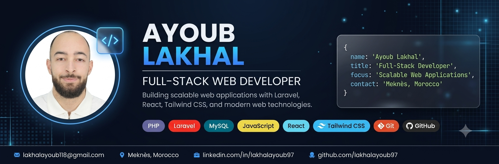
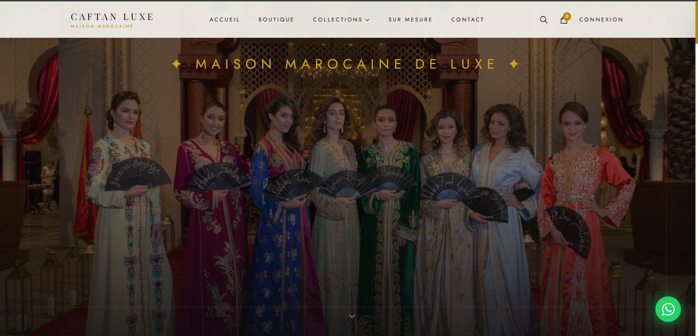
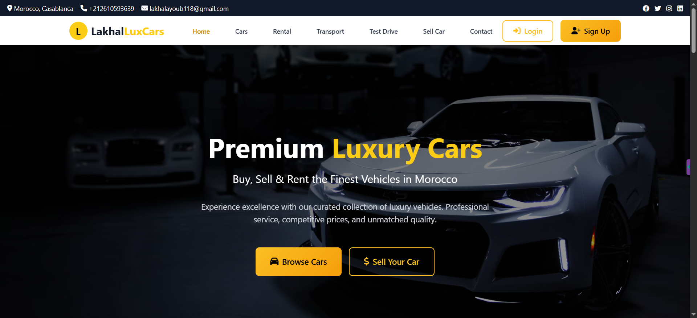
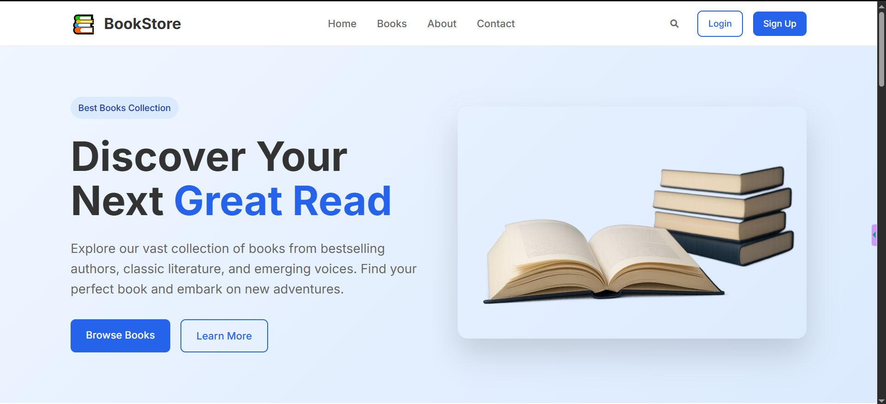
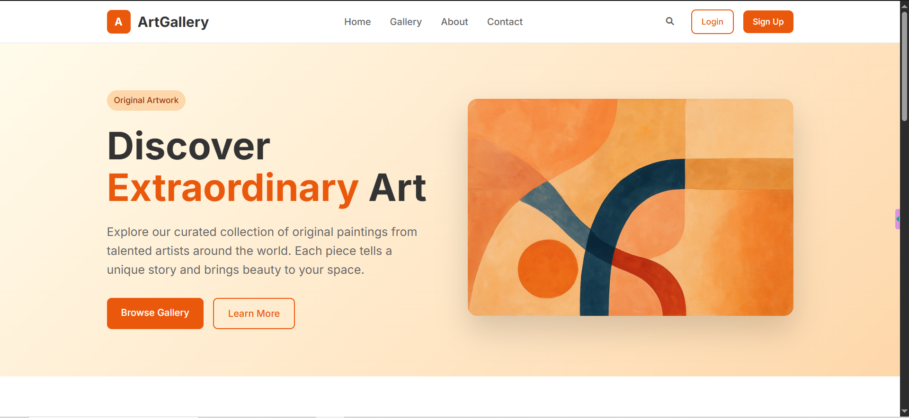
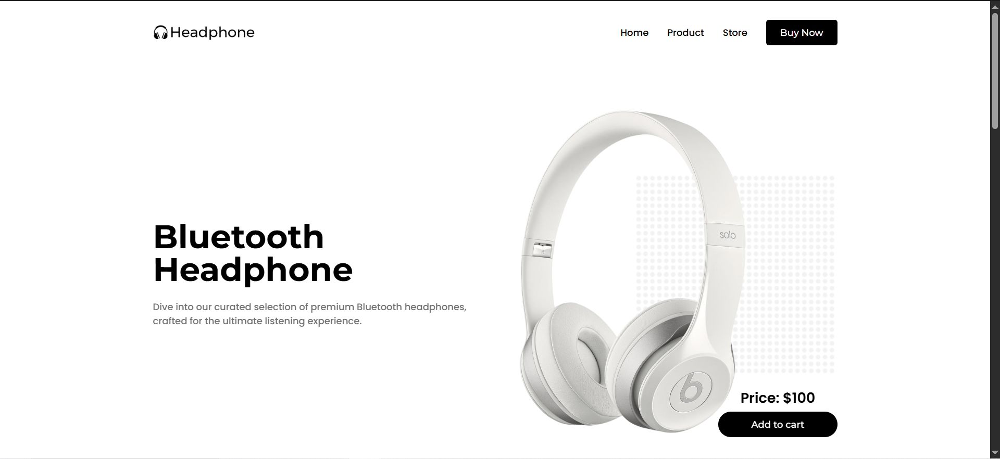

  

---

### 🧑‍💻 About Me

I'm a motivated Junior Web Developer with hands-on experience building responsive web applications and managing IT systems in real-world environments. I'm comfortable across both the front-end and back-end, with a strong focus on performance, user experience, and code quality.

I'm accustomed to freelance work and direct client communication — I design and deliver digital solutions tailored to real needs, and I enjoy turning complex problems into elegant, usable products. I'm currently pursuing a Specialized Technician degree in IT Development, and my goal is to grow into a full-stack developer role where I can make a real impact.

- 🌍 Based in Meknès, Morocco
- 💼 Open to new opportunities
- 🗣️ Arabic (native) · English (fluent) · French (fluent)
- ❤️ Interests: UI/UX design, coding side-projects, email marketing, new tech

---

### 🛠️ Skills

**Front-End**

**Back-End**

**Databases**

**Other Tools**

---

### 🚀 Featured Projects

<table>
<tr>
<td width="50%">

<h4>👘 Caftan Luxe — Luxury Moroccan Fashion</h4>
Full-stack e-commerce app for a luxury Moroccan caftan brand — product catalog, cart, auth, and admin dashboard.
  
<code>Laravel 12</code> <code>React</code> <code>MySQL</code> <code>Tailwind CSS</code>
  
<a href="#">Live Demo</a> · <a href="#">Source Code</a>
</td>
<td width="50%">

<h4>🚗 Automotive Management Platform</h4>
Web platform for car rental and sales with an admin dashboard for inventory, bookings, and customers.
  
<code>PHP</code> <code>MySQL</code> <code>JavaScript</code>
  
<a href="#">Live Demo</a> · <a href="#">Source Code</a>
</td>
</tr>
<tr>
<td width="50%">

<h4>📚 Online Bookstore</h4>
E-commerce platform for books with author/category management, wishlists, and user ratings.
  
<code>PHP</code> <code>MySQL</code> <code>JavaScript</code>
  
<a href="#">Live Demo</a> · <a href="#">Source Code</a>
</td>
<td width="50%">

<h4>🎨 Online Art Gallery</h4>
Platform for discovering and purchasing original artworks, with artist management and secure payments.
  
<code>PHP</code> <code>MySQL</code> <code>JavaScript</code>
  
<a href="#">Live Demo</a> · <a href="#">Source Code</a>
</td>
</tr>
<tr>
<td width="50%">

<h4>🎧 Bluetooth Headphones Store</h4>
Responsive e-commerce site with interactive carousel, filters, and a smooth checkout flow.
  
<code>HTML</code> <code>CSS</code> <code>JavaScript</code> <code>PHP</code>
  
<a href="#">Live Demo</a> · <a href="#">Source Code</a>
</td>
<td width="50%"></td>
</tr>
</table>

> Replace the `#` links above with your live demo and GitHub repo URLs for each project.

---

### 💼 Experience

- **Freelance Web Developer** — *Remote / Freelance* (2024 – Present)
  Building responsive sites with HTML, CSS & JavaScript; working directly with clients on tailored solutions.
- **IT & Network Support (Internship)** — *MAROC PARK* (Apr 2024 – Oct 2024)
  Technical support, network infrastructure, and data processing.
- **IT Technician & Store Manager** — *Atlas Info (Cybershop)* (2022 – 2023)
  Hardware/software/network troubleshooting plus day-to-day store operations.
- **Email Copywriter** — *Freelance* (2021 – 2022)
  High-converting email campaigns for e-commerce brands.

### 🎓 Education

- **Specialized Technician in IT Development** — European School (2024 – 2025)
- **Baccalaureate in Physical Sciences** — Lycée Tarik Ibn Ziyad (2020 – 2021)

---

### 📊 GitHub Stats

  
  

  

---

### 📫 Let's Connect

  
  
  

